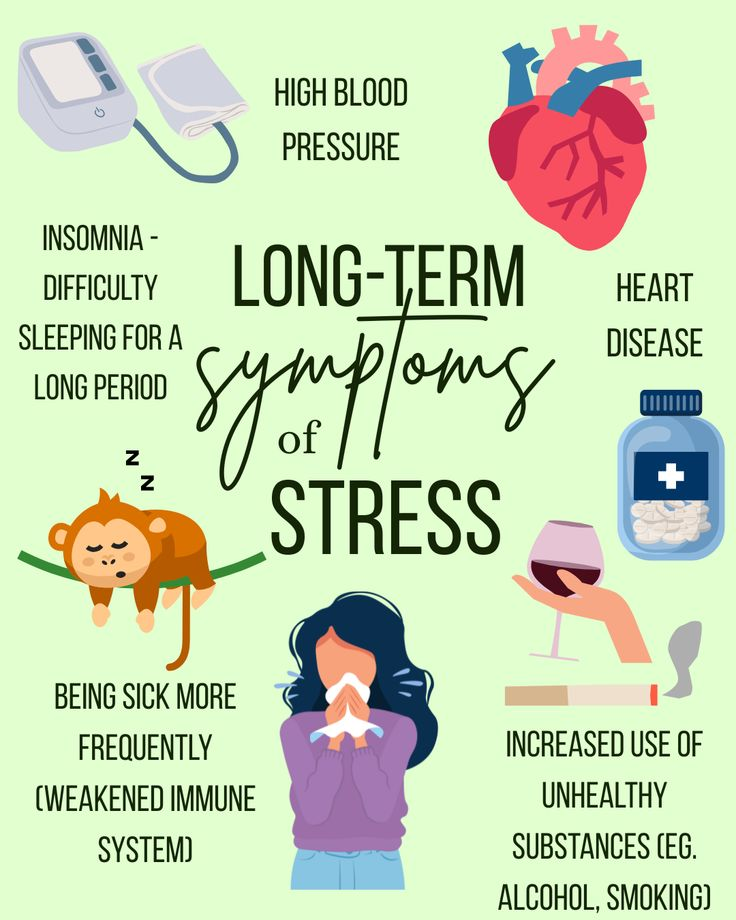

# 🫀 Heart Disease Data Analytics Dashboard

## 1. Introduction
Heart disease remains the **leading cause of death worldwide**, responsible for nearly one-third of all global fatalities. Understanding **patterns, risk factors, and prevention strategies** can significantly improve patient outcomes and inform healthcare policy.

This project develops an **interactive D3.js dashboard** analyzing 8 domains related to heart disease, using data visualization to uncover patterns and correlations.

---

## 2. Types of Heart Disease

**Common types include:**
- **Coronary Artery Disease (CAD)**
- **Heart Failure**
- **Arrhythmia**
- **Valve Disease**
- **Cardiomyopathy**

---

## 3. Spotlight on Heart Failure
  
Heart failure occurs when the heart muscle is unable to pump blood effectively.  
**Causes:** Coronary artery disease, hypertension, diabetes.  
**Symptoms:** Shortness of breath, fatigue, swelling.

---

## 4. Dataset Attributes
Our dataset contains **10 attributes**, categorized as follows:

| Category           | Attribute               | Example Image |
|--------------------|-------------------------|---------------|
| **Demographics**   | Age, Gender              | — |
| **Lifestyle**      | Exercise Habits          | — |
|                    | Smoking                  |  |
|                    | Alcohol Consumption      |  |
| **Clinical**       | Cholesterol Level        |  |
|                    | Blood Pressure           |  |
|                    | BMI                      |  |
|                    | Family Heart Disease     | — |
|                    | Stress Level             |  |

---

## 5. Domain-by-Domain Analysis

### **Domain 1 – Age vs Heart Disease**
- **Goal:** Identify correlation between age groups and heart disease prevalence.
- **Key Insight:** Higher prevalence in 50+ age group.
- **Dashboard:** *(Insert screenshot)*

### **Domain 2 – Gender vs Heart Disease**
- **Goal:** Compare disease rates between male and female.
- **Key Insight:** Males show slightly higher prevalence in dataset.
- **Dashboard:** *(Insert screenshot)*

### **Domain 3 – Blood Pressure vs Heart Disease**
- **Goal:** Assess how blood pressure impacts disease likelihood.
- **Key Insight:** Hypertension strongly linked to heart disease.
- **Dashboard:** *(Insert screenshot)*

### **Domain 4 – Exercise Habits**
- **Goal:** Analyze the protective effect of regular exercise.
- **Key Insight:** Higher exercise frequency correlates with lower disease rates.
- **Dashboard:** *(Insert screenshot)*

### **Domain 5 – Average Cholesterol Level**
- **Goal:** Compare cholesterol levels between healthy and diseased groups.
- **Key Insight:** Diseased patients have higher average cholesterol.
- **Dashboard:** *(Insert screenshot)*

### **Domain 6 – Smoking**
- **Goal:** Evaluate smoking as a risk factor.
- **Key Insight:** Smokers have significantly higher heart disease risk.
- **Dashboard:** *(Insert screenshot)*

### **Domain 7 – Alcohol Consumption**
- **Goal:** Assess the relationship between alcohol intake and disease.
- **Key Insight:** High alcohol consumption correlates with increased prevalence.
- **Dashboard:** *(Insert screenshot)*

### **Domain 8 – Cholesterol Distribution by Gender**
- **Goal:** Identify gender-based differences in cholesterol distribution.
- **Key Insight:** Male cholesterol levels slightly higher on average.
- **Dashboard:** *(Insert screenshot)*

---

## 6. Overall Dashboard Overview
### Light Mode

### Dark Mode

---

## 7. Conclusion & Recommendations
- **Lifestyle factors** (exercise, smoking, alcohol) have a clear impact on heart disease risk.
- **Clinical measures** (blood pressure, cholesterol) remain critical for early detection.
- **Targeted health campaigns** should focus on older adults and high-risk groups.
- Data-driven insights can guide **preventive healthcare policies**.

---

## 8. Technology Stack
- **Frontend:** HTML, CSS, JavaScript (D3.js)
- **Data Processing:** Python, Pandas
- **Visualization:** D3.js custom charts
- **Version Control:** GitHub

---

## 9. Author
**Nguyen The Hien** – Data Analyst in training, passionate about turning data into actionable insights.
